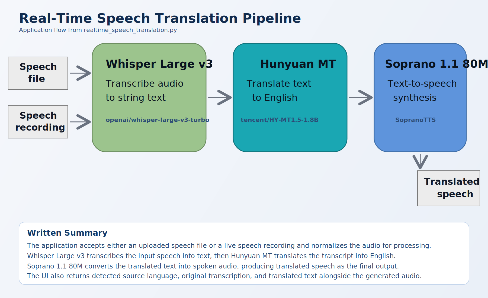

# Real-Time Speech Translation

A pipeline for real-time translation of speech from any language to English using Hunyuan MT, Whisper Large v3, and Soprano 1.1 80m.

## Pipeline Infographic



## Quickstart

```
git clone https://github.com/Jameshskelton/realtime_speech_translation
cd realtime_speech_translation
python3 -m venv venv
source venv/bin/activate
pip3 install -r requirements.txt
python3 realtime_speech_translation.py
```
